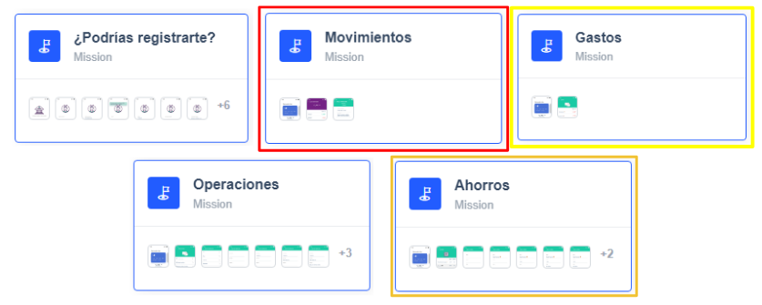
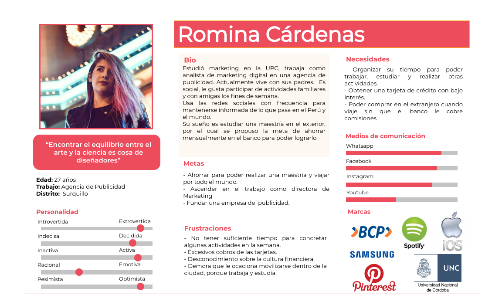
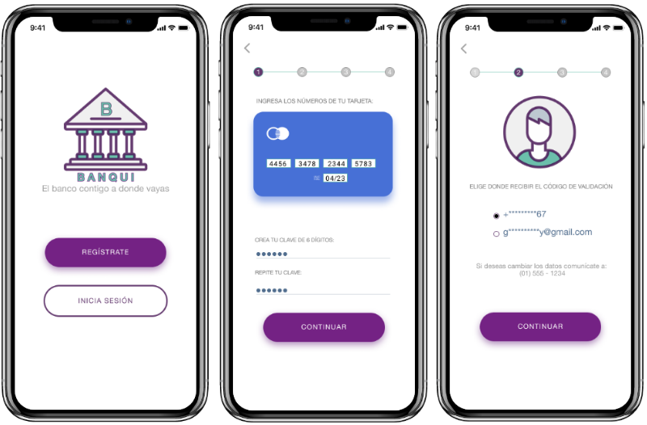
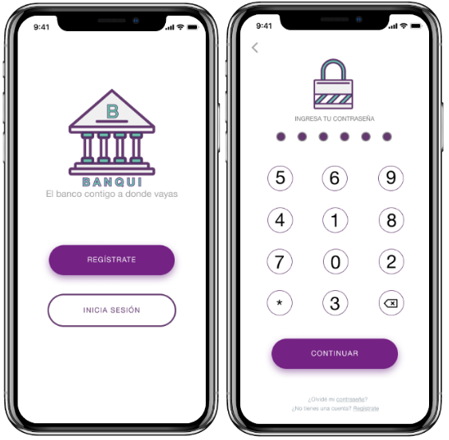
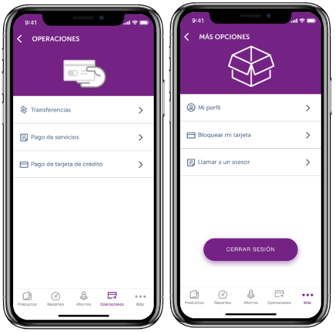

# App Financiera
 
## Índice
 
* [1. Introducción](#1-introducción)
 
* [2. Acerca de la empresa](#2-acerca-de-la-empresa)
 
* [3. Objetivos iniciales del proyecto](#3-objetivos-iniciales-del-proyecto)
 
* [4. Problemas identificados tanto a nivel de negocio como a nivel de usuario](#4-problemas-identificados-tanto-a-nivel-de-negocio-como-a-nivel-de-usuario)
 
* [5. Recomendaciones de próximos pasos para el banco con respecto al app](#5-Recomendaciones-de-próximos-pasos-para-el-banco-con-respecto-al-app)
 
* [6. Links](#6-Links)
 
***
 
## 1. Introducción
 
El banco más importante del país, Pichincha, está planeando lanzar un banco 100% digital bajo el nombre: "Banqui", para ello han venido piloteando un app con un número pequeño de usuarios. Nos presentaron los resultados de este piloto el cual nos sirvió como data para la investigación y rediseño del aplicativo.

## 2. Acerca de la empresa

El Product Manager nos compartió sus impresiones sobre cómo han estado llevando este producto y también nos brindó diferentes recursos para poder hacer un análisis del mismo.
Algunos de sus comentarios fueron:
> Los usuarios que anteriormente han sido clientes de algún banco, nos comparan
  con las aplicaciones de esos bancos, parece que hay cosas que extrañan.

> La aplicación que estamos probando es para iOS, sin embargo, para hacer un
  lanzamiento nacional necesitamos crear un app para Android.

> Nos falta acercarnos un poco más a los usuarios jóvenes, 100% digitales, los
  que usan Netflix, Uber, Spotify, Instagram, entre otros.

## 3. Objetivos iniciales del proyecto

- Utilizar los recursos brindados por la empresa para identificar los problemas que tiene la aplicación al momento de interactuar con los usuarios.
- Rediseñar el producto ya existente, solucionando los problemas identificados.
- Ampliar el mercado de la aplicación para un público más joven proponiendo mejoras.

## 4. Problemas identificados tanto a nivel de negocio como a nivel de usuario

Después de los testeos, pudimos detectar diversos problemas de usabilidad y de seguridad. 

- **Registro:** Al ser un paso esencial para el uso de la aplicación, carecía de seguridad. Necesitaba un rediseño que le dé seguridad a los usuarios.
- **Movimientos:** La presentación de esta sección es muy confusa para el usuario, el que necesita un rediseño que pueda hacer más fácil su uso. 
- **Gastos:** Al sonar como un complemento de la funcionalidad pasada, cae en confusión con esta. Esta funcionalidad tiene muchos puntos buenos que deberían ser optimizados de una mejor manera.
- **Operaciones:** Esta sección está bien llevada, pero al ser una funcionalidad que realiza transacciones le hacía falta seguridad.
- **Ahorros:** Esta sección es algo muy particular, que cae en confusión con las cuentas. Ahorros, es nuevo para los usuarios, y tiene mucho valor para ellos.

**User Persona**

**Customer Journey Map**

## 5. Recomendaciones de próximos pasos para el banco con respecto al app

El rediseño propuesto para registro e inicio de sesión:

Propuestas para las siguientes funcionalidades:

El trabajo de rediseño realizado brinda mayor seguridad y facilita la navegación del usuario. Cabe recalcar que quedan ideas por implementar, que podríamos ser explotados, dándole a la aplicación mayor valor.

## 6. Links

- Prototipo navegable de alta fidelidad [Figma](https://www.figma.com/file/Yhw5tgS0JAjOzPdZFeSGf3/S02E01-App-Financiera-Copy-of-Team?node-id=50%3A73).

- Carpeta compartida [Drive](https://drive.google.com/drive/folders/11epMGEDLNHaRXXNwIc8wQn-CMrwCqNxw).

  - Video en [Loom]( ).

